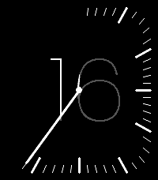
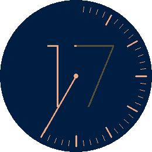

# Afterglow

*The hour, quietly burning down.*

  

A Pebble watchface (v1.0.0).

Afterglow shows the hour as a single large numeral in hairline type — and
then lets the minutes eat into it.

A slender hand sweeps clockwise from twelve. Behind it the minute marks
appear one by one, so the rim fills as the hour fills. And the part of the
numeral the hand has already swept past is dimmed, so the bright, unspent
remainder of the hour shrinks away in front of you. At quarter past, a
quarter of the numeral has gone dim. At quarter to, only a quarter is left
lit. On the hour everything resets: the rim clears, the numeral comes back
to full strength, and it begins again.

You read the hour as a number and the minutes as a shape — no second scale
to decode, no small print.

Both colours are yours to choose: one for the background, one for the hand,
the marks and the numeral. The dimmed shade is mixed from the two, so the
whole face stays in one palette whatever you pick. Choose two colours with
real contrast between them — the dimmed segment is derived from that
contrast, and a low-contrast pair will wash it out.

Also configurable: 24-hour or 12-hour display.

Built for Pebble Time 2 and Pebble Round 2, with a layout drawn for each —
the round face uses a full circle of marks, the rectangular one follows the
rounded edge of the display.

## Settings

- **Background** — the face colour.
- **Hand, marks and numeral** — everything drawn on top of it.
- **24-hour clock** — off shows 1 to 12 without a leading zero.

## Platforms

- Pebble Time 2 (`emery`)
- Pebble Round 2 (`gabbro`)

## Building

With the [Pebble SDK](https://developer.repebble.com/sdk/):

```bash
pebble build
pebble install --emulator emery
```

The repository can also be imported into CloudPebble as is.

## Release notes

### 1.0.0

First release.

## License

MIT License, see [LICENSE](LICENSE). The bundled fonts are not covered by it and
remain under their own licenses.
